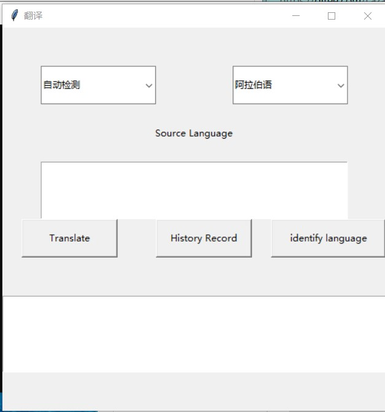

# LightTranslation: A SCU 2023Spring Network Project
> The Translation App is a software application that enables users to translate text from one language to another. It utilizes the Baidu translation API to provide accurate and reliable translations in various languages. The app supports both single sentence translations and multiple sentence translations, offering users flexibility in their translation needs.
>
> The app's codebase includes modules for translation, user registration and authentication, as well as GUI interactions. Users can input their desired source text and target language through the command line or a graphical user interface. The app then makes API requests to the Baidu translation service to retrieve the translated text. The translations are stored in a translation history, allowing users to review their past translations.
>
> Overall, the Translation App provides a foundation for text translation, but also encourages exploration and enhancement, making it a versatile tool for language translation needs.

## Table of Contents
* [General Info](#general-information)
* [Technologies Used](#technologies-used)
* [Features](#features)
* [Screenshots](#screenshots)
* [Setup](#setup)
* [Usage](#usage)
* [Room for Improvement](#room-for-improvement)<!-- * [License](#license) -->


## General Information
The Translation App is a simple Python application that utilizes the Baidu translation API to provide translation services. It allows users to log in, register, translate text, and view their translation history.

### Motivation

The Translation App was developed to address the need for a straightforward and user-friendly translation tool. The goal was to create a convenient application that empowers users to easily translate text between different languages using the Baidu translation API. This project aimed to simplify the translation process and provide users with a seamless experience.

By developing this app, we aimed to:

- Enable users to perform translations quickly and efficiently.
- Provide an intuitive and user-friendly interface for ease of use.
- Showcase the capabilities and potential of the Baidu translation API.
- Encourage community contributions and improvements to enhance the functionality of the application.

We invite you to explore this app and leverage its features to perform seamless translations across different languages.


## Technologies Used
The Translation App was developed using the following technologies and libraries:

- Python 3.7: The core programming language used for the development of the app.
- [Baidu Translation API](https://your-api-docs-link.com/): The API used for translating text between different languages.
- [Socket](https://docs.python.org/3/library/socket.html): A Python library used for network connections.
- [Time](https://docs.python.org/3/library/time.html): A Python library used for time-related functionality.
- [func_timeout](https://pypi.org/project/func-timeout/): A Python library used for adding timeouts to function calls.
- [SQLite3](https://docs.python.org/3/library/sqlite3.html): A Python library used for working with SQLite databases.
- [PyCharm Community Edition](https://www.jetbrains.com/pycharm/): The Python IDE (integrated development environment) used for writing and testing the app code.
- [Tkinter](https://docs.python.org/3/library/tkinter.html): A Python library used for creating the graphical user interface (GUI) of the app.
- [PyInstaller](https://www.pyinstaller.org/): A Python library and command-line tool used for packing the app into an executable file.


## Features
The Translation App offers a range of powerful and user-friendly features, including:

-**User Registration and Login:** Users can create a new account by registering with their email and password, and then log in securely to access the app's functionality.
-**Text Translation:** Users can input text in one language and select their desired target language for translation. The app utilizes the Baidu translation API to provide accurate and instant translations.
-**Translation History:** The app keeps track of all translations made by the user and displays them in a history panel. This allows users to conveniently revisit and reference their previous translations.
-**Timeout Functionality:** To ensure optimal performance, the app includes a timeout feature using the `func_timeout` library. It prevents excessively long translation requests from affecting the overall user experience.
-**Sleek and Intuitive GUI:** The app's graphical user interface, developed with Tkinter, is designed to be elegant, intuitive, and easy to navigate. Users can quickly access and utilize the app's features without any technical barriers.
-**Cross-Platform Compatibility:** The Translation App is compatible with various operating systems, including Windows, macOS, and Linux, thanks to the PyInstaller library, which packages the app into an executable file.
-**Secure User Data Storage:** The app stores user registration details securely using the SQLite3 library, ensuring the protection of sensitive user information.


## Screenshots

<！-- If you have screenshots you'd like to share, include them here. -->


## Setup
To run the Translation App and ensure that all the necessary Python modules are installed, follow the steps below:

1.**Python Installation**: Make sure Python is installed on your computer. You can download the latest version of Python from the official website at [python.org](https://www.python.org/downloads/). Follow the installation instructions provided.

2.**Python Module Installation**: Open the terminal or command prompt and navigate to the project directory. Run the following commands to install the required Python modules:

   ```bash
   pip install requests
   pip install urllib3
   pip install func_timeout
   ```
   
   **Note**: If you encounter any errors during the installation process, make sure you have the latest version of `pip` installed. You can upgrade `pip` by running the following command:
   
   ```bash
   pip install --upgrade pip
   ```
   
3.**Editor Installation**: If you don't have an IDE (integrated development environment) installed, it is recommended to install [PyCharm Community Edition](https://www.jetbrains.com/pycharm/). PyCharm provides a user-friendly interface and simplifies the development and testing process.

4.**Running the App**: Once all the required modules are installed, open the project in your chosen editor (e.g., PyCharm). Locate the main Python file (`client.py` or `client.exe` ) and run it to start the Translation App.

   **Note**: If you encounter any issues or errors while running the app, make sure the server and client are configured correctly on the same computer. Also, ensure that any necessary firewall settings or network configurations are in place to allow communication between the server and client.

Follow these steps, and you should be able to successfully set up and run the Translation App on your computer.


## Usage
How does one go about using it?
Provide various use cases and code examples here.

`write-your-code-here`
已存在账号cwj，密码cwj<br />
## 登陆注册用例
| number | precondition |     input    | forward | output |
|--------|--------------|--------------|---------|--------|
| 1      | 进入登陆        | 账号：  密码：     |   提示为未输入账号密码     | 提示为未输入账号密码      |
| 2      |  进入登陆            |   账号：cwj密码：11    | 提示输入账号密码错误        |  提示输入账号密码错误      |
| 3      |  进入登陆            |   账号：cwj密码：cwj   |   提示登陆成功，进入翻译界面      |提示登陆成功，进入翻译界面        |
| 4      |  进入注册            |   账号：密码：   |   提示为未输入账号密码      |提示为未输入账号密码        |
| 5      |  进入注册            |   账号：cwj密码：cwj   |   提示账号密码已存在      |提示账号密码已存在        |
| 6      |  进入注册            |   账号：weqw密码：fdsdf   |   提示注册成功，返回登陆页面界面      | 提示注册成功，返回登陆页面界面        |

## 翻译用例
| number | precondition |     input    | forward | output |
|--------|--------------|--------------|---------|--------|
|1       |进入翻译页面|选择：自动检测-->中文，输入“it is a test”，点击”Translate“按钮|正确显示翻译结果|正确显示翻译结果：”这是一次测试“|
|2       |进入翻译页面|输入“”，点击”Translate“按钮|提示输入为空|提示输入为空|
## 语言识别用例
| number | precondition |     input    | forward | output |
|--------|--------------|--------------|---------|--------|
|1       |进入翻译页面|输入“it is a test”，点击”identify language“按钮|正确显示识别结果|正确显示识别结果：”英语“|
|2       |进入翻译页面|输入“”，点击”identify language“按钮|提示输入为空|提示输入为空|
## 查看历史记录用例
| number | precondition |     input    | forward | output |
|--------|--------------|--------------|---------|--------|
|1       |进入翻译页面|点击”History Record“按钮|正确显示历史记录|正确显示历史记录|


## Room for Improvement
While the Translation App provides basic functionality for translating text, there are several areas that could be improved:

1. **Error Handling**: The app currently lacks robust error handling mechanisms. It would be beneficial to implement proper error handling to handle cases such as invalid input, network errors, and API failures. This would enhance the overall user experience and make the app more reliable.
2. **User Registration and Authentication**: The app does not currently have user registration and authentication features. Adding these functionalities would allow users to have personalized translation histories, preferences, and settings.
3. **Improved GUI**: The current version of the app primarily focuses on command-line interactions. Enhancing the graphical user interface (GUI) would result in a more user-friendly and visually appealing application.
4. **Performance Optimization**: Depending on the size of the text being translated and the number of requests made, the app's performance could be improved. Implementing optimizations such as batch translations and asynchronous requests could enhance the app's speed and efficiency.

## TODOs for Future Development

While the Translation App provides basic functionality for translating text, there are several areas that could be improved:

1. **Error Handling**: The app currently lacks robust error handling mechanisms. It would be beneficial to implement proper error handling to handle cases such as invalid input, network errors, and API failures. This would enhance the overall user experience and make the app more reliable.
2. **Improved GUI**: The current version of the app primarily focuses on a simple GUI that satisfy the basic needs. Enhancing the graphical user interface (GUI) would result in a more user-friendly and visually appealing application.
3. **Performance Optimization**: Depending on the size of the text being translated and the number of requests made, the app's performance could be improved. Implementing optimizations such as batch translations and asynchronous requests could enhance the app's speed and efficiency.

Here are some ideas for future development and enhancements:

1. **Language Detection**: Though embedded language detection functionality to automatically identify the source language. We haven't show it explicitly in the gui.
2. **Additional Translation Services**: Integrate additional translation services and APIs to provide users with more options and improve translation accuracy. This could include services like Google Translate or Microsoft Translator.
3. **Language Support**: Expand the language support of the app to include a wider range of languages. This would enable users to translate text in various languages, catering to a more diverse user base.
4. **Caching and Offline Support**: Implement caching mechanisms to store translations locally and provide offline support. This would be useful in scenarios where an internet connection is unavailable or unreliable.
5. **Notification System**: Introduce a notification system to notify users of completed translations, errors, or other relevant events. This could be done through emails, push notifications, or in-app notifications.


